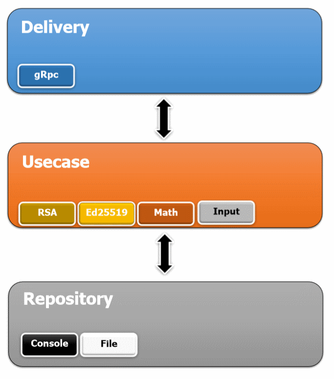

#  Bidirectional gRPC streaming  with signature


This project implements a FindMaxNumber with Bi-Directional gRPC streaming system in which a client will send a stream of number and each number will be signed by the private key of the client. The server will verify the client signature and respond with a stream of numbers  that represent the current maximum between all these integers. 

As an example if client send (1,5,3,6,2,20) as stream of numbers with correct signature, server will respond with  (1,5,6,20) as stream of numbers.

## Requirements

- go 1.9+
- dep installed
- protobuf installed
- go support for protobuf installed

## Commands

Client contains has the following 4 commands:
- `./client init`

     create public/private key pairs. You can specify encryption type by flag `-encryption` and home directory by `--home`

-  `./client check`

    check client public/private key pairs stored in home directory. 

- `./client start` 

    start client application. You can specify server address by flag `--server` , server port by flag `--port` , protocol by `--protocol` and  input type by `--input`

- `./client version` 

    shows client application version


Server contains has the following 3 commands:

-  `./server check`

    check client public key stored in home directory. 

- `./server start` 

    start server application. You can specify server address by flag `--server` (i.e. localhost,IPv6, IPv4 or etc.) , server port by flag `--port` , protocol by `--protocol`

- `./server version` 

    shows server application version


## Use

Initialize client to generate key and random numbers by `./client init`.

Check client by `./client check`.

Client output:

```bash
./client check
2019/03/27 10:43:51 found ed25519 public key
2019/03/27 10:43:51 found ed25519 private key
```

Check Server by `./server check`

Server output:
```bash
./server check
2019/03/27 10:43:51 found ed25519 public key
```

Start server `./server start` and `./client start` in two separate terminal 

Client output example:

```bash 
./client start
tcp://127.0.0.1:3000
2019/03/27 10:53:53 send number 4860
2019/03/27 10:53:53 send number 794
2019/03/27 10:53:53 send number 4357
2019/03/27 10:53:53 send number 4163
2019/03/27 10:53:53 send number 2354
2019/03/27 10:53:53 send number 4734
2019/03/27 10:53:53 send number 3971
2019/03/27 10:53:53 new max number 4860 received
2019/03/27 10:53:53 send number 8100
2019/03/27 10:53:53 send number 5412
2019/03/27 10:53:53 send number 9978
2019/03/27 10:53:53 new max number 8100 received
2019/03/27 10:53:53 send number 7362
2019/03/27 10:53:53 new max number 9978 received
2019/03/27 10:53:53 send number 5406
2019/03/27 10:53:53 send number 4201
2019/03/27 10:53:53 send number 9238
2019/03/27 10:53:53 send number 598
2019/03/27 10:53:53 send number 6758
2019/03/27 10:53:53 send number 2714
2019/03/27 10:53:53 send number 8187
2019/03/27 10:53:53 send number 2649
2019/03/27 10:53:53 send number 69136
2019/03/27 10:53:53 new max number 69136 received
```

Server output example:

```bash
./server start
2019/03/27 10:53:50 start listening to 3000
2019/03/27 10:53:53 start serving new client
2019/03/27 10:53:53 send new max=4860
2019/03/27 10:53:53 send new max=8100
2019/03/27 10:53:53 send new max=9978
2019/03/27 10:53:53 send new max=69136
2019/03/27 10:53:53 client closed the stream.
````


## Architecture

We assume the following 4 layer architecture:
- Models

    This layer, will store any object’s struct and its method.

    In this project data model is an integer.

- Repository
    
    Repository will act as data store handler. 

    In this project we use repository to get stream of numbers in client application. We use file and console repository as repository.

- Usecase

    This layer will act as the business process handler. Any process will handled here. This layer will decide, which repository layer will use. And have responsibility to provide data to serve into delivery. Process the data doing calculation or anything will done here.

    In this project we use the following as usecase:
    - Rsa

        Let the client application to create Rsa 1024 bit public/private key pair and sign data with private key. 
        
        Server use Rsa signature verification method to verify client data.
    - Ed25519

        Let the client application to create Ed25519 public/private key pair and sign data with private key. 
        
        Server use Ed25519 signature verification method to verify client data.
    - Math

        Implement FindMaxNumber logic
    - Input

        Select data from repository and pass it to the delivery in client app.

- Delivery


    This layer will act as the presenter. Decide how the data will presented. Could be as REST API, or HTML File, or gRPC whatever the delivery type. 
    
    In this project we use gRPC as the delivery method
    
The following picture shows the project architecture



## To do
- Use Amino  (i.e. Protobuf4)
- Encrypt the packet in order to prevent packet sniffing
- Add sequence filed in request model in order to detect missing packets (numbers) and prevent man in the middle to change order of packets
- It is assumed that the public key of the client is not known in advance. The only way to mitigate this is with a public key authentication system, such as the Web-of-Trust or Certificate Authorities
- Use Amino  (i.e. Protobuf4)
- It is assumed that the server is serving at most one instance of client application. FindMaxNumber should be changed in order to server multiple clients at the same time.